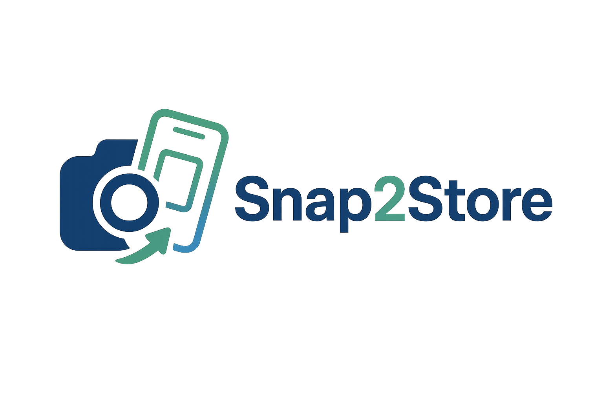

<p align="center">
  
</p>

# Snap2Store

[中文文档](docs/README_zh.md)

Snap2Store is designed for Apple developers to solve the problem that screenshots captured from the iOS simulator cannot be directly used in the App Store.  
It automatically adds device frames and adjusts to the required dimensions, making your app screenshots more professional and compliant with App Store standards.

---

## Background

Screenshots taken from the iOS simulator cannot be uploaded directly to the App Store because:
- ❌ Sizes do not match App Store requirements  
- ❌ Missing device frames, resulting in poor presentation  
- ❌ Manual processing is time-consuming and inefficient  

This tool solves these problems with one command:
- ✅ Automatically adds real device frames  
- ✅ Outputs screenshots that meet App Store requirements  
- ✅ Batch processing for improved developer efficiency  

---

## Requirements

```bash
pip install pillow psd-tools
```

---

## Usage

### Typical Workflow

1. **Capture screenshots** in the iOS simulator  
2. **Run the processing tool** for the target device  
3. **Get processed screenshots** with the correct frame and size  
4. **Upload directly** to App Store Connect  

---

### iPad Screenshots

```bash
# Process a single screenshot
python ipad_batch.py screenshot.png

# Batch process all screenshots in a folder
python ipad_batch.py screenshots_folder/
```

---

### iPhone Screenshots

```bash
# Process a single screenshot
python iphone_batch.py screenshot.png

# Batch process all screenshots in a folder
python iphone_batch.py screenshots_folder/
```

---

## Output

- 📁 Processed files are saved in the `output/` folder  
- 📝 File naming format: `original_filename_framed.jpg`  
- 🎯 **App Store compliant**: correct dimensions and format  
- 🖼️ JPEG quality: 85% with optimized compression  
- 🎨 Transparency removed, converted to RGB  

---

### Output Dimensions

- 📱 **iPhone**: 1242 × 2688 px  
- 📱 **iPad**: 2064 × 2752 px  

These dimensions fully meet App Store Connect requirements, so the screenshots can be uploaded directly.

---

## Tech Stack

- **Python 3.x**  
- **Pillow (PIL)**: image processing  
- **psd-tools**: PSD file parsing  
